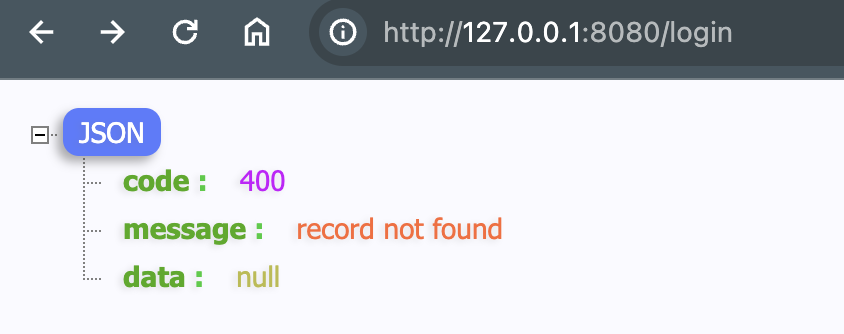

通用返回结构可以使返回对象更加标准， 方便对接前端。

## 1. 定义通用结构

```go
type Ecode struct {
	Code    int    `json:"code"`    // code, 可以自定错误代码
	Message string `json:"message"` // 消息
	Data    any    `json:"data"`    // 数据
}
```

## 2. 使用通用结构

在各个 Handler 中， 找到需要返回的地方， 修改为通用结构

例如 `PingHandler`

```go
// c.String(http.StatusOK, "pong")

c.JSON(http.StatusOK, tools.Ecode{
	Code:    http.StatusOK,
	Message: "pong",
})
```

再如 LoginHandler 登录失败时

```go
// c.JSON(http.StatusBadRequest, gin.H{
// 	"msg":   "user not found",
// 	"error": fmt.Sprintf("%v", err),
// })

c.JSON(http.StatusBadRequest, tools.Ecode{
	Code:    http.StatusBadRequest,
	Message: fmt.Sprintf("%v", err),
})
```


