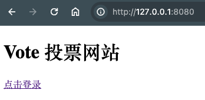
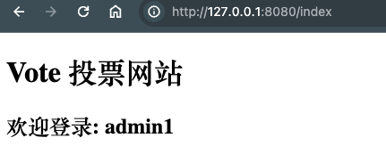

## 1. 使用 SQL 转 Struct 匹配对象

> http://www.gotool.top/handlesql/sql2gorm

建表 SQL

```sql
CREATE TABLE `users` (
  `id` bigint(20) NOT NULL AUTO_INCREMENT,
  `name` varchar(50) COLLATE utf8mb4_bin DEFAULT NULL,
  `password` varchar(50) COLLATE utf8mb4_bin DEFAULT NULL,
  `created_time` datetime DEFAULT NULL,
  `updated_time` datetime DEFAULT NULL,
  PRIMARY KEY (`id`)
) ENGINE=InnoDB AUTO_INCREMENT=3 DEFAULT CHARSET=utf8mb4 COLLATE=utf8mb4_bin;
```

转换的对象

```go

type User struct {
	Id          int64     `gorm:"column:id;primary_key;AUTO_INCREMENT;NOT NULL" form:"id" json:"id"`
	Name        string    `gorm:"column:name;default:NULL" form:"name" json:"name"`
	Password    string    `gorm:"column:password;default:NULL" form:"password" json:"password"`
	CreatedTime time.Time `gorm:"column:created_time;default:NULL" form:"createdTime" json:"createdTime"`
	UpdatedTime time.Time `gorm:"column:updated_time;default:NULL" form:"updatedTime" json:"updatedTime"`
}
```

## 2. 创建 Gin RouterGroup 管理 Index 页面

在 `router/router.go` 中创建 **路由分组**

```go
	// 首页
	r.GET("/", logic.Index)

	{
		index := r.Group("")
		// 使用中间件， 检查cookie
		index.Use(logic.IndexLoginCheckerMiddleware)

		// 登录后首页
		index.GET("/index", logic.IndexLogin)
	}
```

公共首页



登录后首页




## 3. 成功登录后设置 Cookie 与跳转

1. 使用 `c.SetCookie` 设置 Cookie
2. 使用 `c.Redirect` 跳转到登录首页。 注意不同的状态的跳转后 **请求方法** 是不同的。
    + 303(SeeOther): 只使用 **GET 方法** 跳转。
    + 307(Temporary)/308(Permanent): 保持 **当前方法** 跳转 (Post -> Post)

```go
func PostLoginHandler(c *gin.Context) {
	// #5 获取表单数据
	user := &model.User{}

	err := c.ShouldBind(user)
	if err != nil {
		c.String(http.StatusBadRequest, "bad request")
		// 显示错误信息之后， 一定要 return 结束后序逻辑
		return
	}

	// # 查询用户
	ret, err := model.GetUser(user)
	if err != nil {
		c.JSON(http.StatusBadRequest, gin.H{
			"msg":   "user not found",
			"error": fmt.Sprintf("%v", err),
		})

		return
	}

	// domain 设置为空， 任意域名都可以生效
	// domain 设置不为空， 则仅对特定域名生效
	c.SetCookie("name", ret.Name, 3600, "/", "", true, false)

	// 成功后显示用户信息
	// 303: redirect with GET method
	// 307: redirect with Current method (post -> post)
	c.Redirect(http.StatusSeeOther, "/index")
	// c.JSON(http.StatusOK, ret)

}
```

## 4. 设置中间件

检查 cookie 则跳转到登录页面

```go
// IndexLoginCheckerMiddleware 检查 cookie 则跳转到登录页面
func IndexLoginCheckerMiddleware(c *gin.Context) {

	name, err := c.Cookie("name")
	if err != nil || name == "" {
		// 跳转到登录页面
		c.Redirect(http.StatusSeeOther, "/login")
		// c.Abort()
		return
	}

	c.Next()
}
```