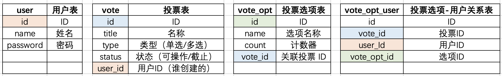

1. 用户表
    + 管理用户列表
2. 投票表
    + 管理投票列表
    + 管理投票与其创建者的关系
3. 投票选项表
    + 管理选项
    + 管理选项与其绑定投票的关系
4. 选项-用户表
    + 管理用户与投票选项的关系。
    + 避免用户重复投票。



```sql
-- 用户表
CREATE TABLE `user` (
  `id` bigint NOT NULL AUTO_INCREMENT,
  `name` varchar(50) COLLATE utf8mb4_bin DEFAULT NULL,
  `password` varchar(50) COLLATE utf8mb4_bin DEFAULT NULL,
  `created_time` datetime DEFAULT NULL ON UPDATE CURRENT_TIMESTAMP,
  `updated_time` datetime DEFAULT NULL ON UPDATE CURRENT_TIMESTAMP,
  PRIMARY KEY (`id`)
) ENGINE=InnoDB AUTO_INCREMENT=5 DEFAULT CHARSET=utf8mb4 COLLATE=utf8mb4_bin;

-- 投票表
-- 绑定投票与其创建用户的关系
CREATE TABLE `vote` (
  `id` bigint NOT NULL AUTO_INCREMENT,
  `title` varchar(255) COLLATE utf8mb4_bin DEFAULT NULL,
  `type` int DEFAULT NULL COMMENT '0 for single, 1 for multiple choice',
  `status` int DEFAULT NULL COMMENT '0 for normal, 1 for expired',
  `user_id` bigint DEFAULT NULL COMMENT 'who created',
  `expired_in` bigint DEFAULT NULL,
  `created_time` datetime DEFAULT NULL ON UPDATE CURRENT_TIMESTAMP,
  `updated_time` datetime DEFAULT NULL ON UPDATE CURRENT_TIMESTAMP,
  PRIMARY KEY (`id`)
) ENGINE=InnoDB DEFAULT CHARSET=utf8mb4 COLLATE=utf8mb4_bin;

-- 投票选项表
-- 绑定投票选项表与投票表关系
CREATE TABLE `vote_opt` (
  `id` bigint NOT NULL AUTO_INCREMENT,
  `name` varchar(255) COLLATE utf8mb4_bin DEFAULT NULL COMMENT '选项名称',
  `count` int DEFAULT NULL COMMENT '选项投票计数器',
  `vote_id` bigint DEFAULT NULL COMMENT '绑定到的投票单',
  `created_time` datetime DEFAULT NULL ON UPDATE CURRENT_TIMESTAMP,
  `updated_time` datetime DEFAULT NULL ON UPDATE CURRENT_TIMESTAMP,
  PRIMARY KEY (`id`)
) ENGINE=InnoDB DEFAULT CHARSET=utf8mb4 COLLATE=utf8mb4_bin;

-- 投票选项用户关系表
-- 防止用户重复投票
CREATE TABLE `vote_opt_user` (
  `id` bigint NOT NULL,
  `vote_id` bigint DEFAULT NULL COMMENT '表单ID',
  `user_id` bigint DEFAULT NULL COMMENT '投票用户ID',
  `vote_opt_id` bigint DEFAULT NULL COMMENT '选项ID',
  `created_time` datetime DEFAULT NULL ON UPDATE CURRENT_TIMESTAMP,
  `updated_time` datetime DEFAULT NULL ON UPDATE CURRENT_TIMESTAMP,
  PRIMARY KEY (`id`)
) ENGINE=InnoDB DEFAULT CHARSET=utf8mb4 COLLATE=utf8mb4_bin;
```