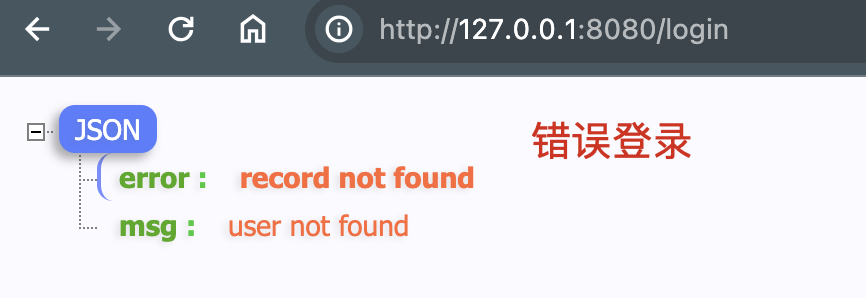

## 1. 使用 docker-compose 创建 MySQL 实例

使用 docker-compose 管理 Mysql 容器

```yaml
# docker-compose.yml

version: '3.1'

services:
  db:
    network_mode: default
    image: mysql:8.3
    # command: --default-authentication-plugin=mysql_native_password
    restart: always
    environment:
      MYSQL_ROOT_PASSWORD: Mysql12345
    volumes:
      - ./mysql-data:/var/lib/mysql
    ports:
      - 3306:3306
```

运行 MySQL 容器

```bash
$ docker-compose up -d
```

## 2. 初始化数据库和表

```sql
SET NAMES utf8mb4;
SET FOREIGN_KEY_CHECKS = 0;

-- ----------------------------
-- Table structure for users
-- ----------------------------
DROP TABLE IF EXISTS `users`;
CREATE TABLE `users` (
  `id` bigint(20) NOT NULL AUTO_INCREMENT,
  `name` varchar(50) COLLATE utf8mb4_bin DEFAULT NULL,
  `password` varchar(50) COLLATE utf8mb4_bin DEFAULT NULL,
  `created_time` datetime DEFAULT NULL,
  `updated_time` datetime DEFAULT NULL,
  PRIMARY KEY (`id`)
) ENGINE=InnoDB AUTO_INCREMENT=3 DEFAULT CHARSET=utf8mb4 COLLATE=utf8mb4_bin;

-- ----------------------------
-- Records of users
-- ----------------------------
BEGIN;
INSERT INTO `users` (`id`, `name`, `password`, `created_time`, `updated_time`) VALUES (1, 'admin', 'admin', '2024-03-31 16:42:40', '2024-03-31 16:42:42');
INSERT INTO `users` (`id`, `name`, `password`, `created_time`, `updated_time`) VALUES (2, 'admin1', 'admin1', '2024-03-31 16:45:46', '2024-03-31 16:45:48');
COMMIT;

SET FOREIGN_KEY_CHECKS = 1;
```

## 3. 单例模式创建 gorm 连接

```go
// 创建 mysql 连接

package main

import (
	"fmt"
	"gorm.io/driver/mysql"
	"gorm.io/gorm"
)

// DBConn 连接数据库
// #7. 连接数据库
// https://gorm.io/docs/connecting_to_the_database.html
func DBConn() *gorm.DB {
	dsnfmt := "%s:%s@tcp(%s:%d)/%s?charset=utf8mb4&parseTime=True&loc=Local"

	dsn := fmt.Sprintf(dsnfmt,
		"root", "Mysql12345",
		"127.0.0.1", 3306,
		"vote")

	db, err := gorm.Open(mysql.Open(dsn), &gorm.Config{})

	if err != nil {
		panic(err)
	}

	return db

}


// 定义全局 DB 连接
var GlobalConn *gorm.DB

// 初始化函数， 在 main 函数之前执行
func init() {
	if GlobalConn == nil {
		GlobalConn = DBConn()
	}
}
```

## 4. 在登录请求中查询数据库

```go
func postLoginHandler(c *gin.Context) {
	// #5 获取表单数据
	user := &User{}

	err := c.ShouldBind(user)
	// 省略...

	// #7. 连接数据库, 查询用户
	// https://gorm.io/docs/query.html
	tx := GlobalConn.Table("users").Where("name = ? AND password = ?", user.Name, user.Password).First(user)
	if tx.Error != nil {
		c.JSON(http.StatusBadRequest, gin.H{
			"msg":   "user not found",
			"error": fmt.Sprintf("%v", tx.Error),
		})

		return
	}

	// 成功后显示用户信息
	c.JSON(http.StatusOK, user)
}
```


