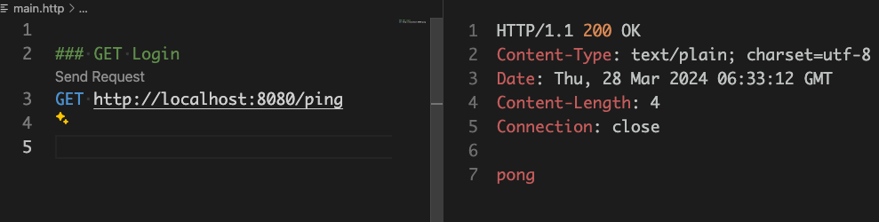

1.  初始化项目

2. 使用 gin 首先最基本的健康检查页面

```go
package main

import (
	"net/http"

	"github.com/gin-gonic/gin"
)

func main() {
	r := gin.Default()

	// 健康检查接口
	r.GET("/ping", pingHandler)

	err := r.Run(":8080")
	if err != nil {
		panic(err)
	}
}

func pingHandler(c *gin.Context) {
	// 这里的 status 不建议直接使用 200，建议使用 http.StatusOK
	// 语义化之后更加直观，不容易出错
	c.String(http.StatusOK, "pong")
}
```

3. 创建 Makefile ， 设置常用启动命令

```Makefile
run: tidy
	go run .

tidy:
	go mod tidy
```

使用 makefile 启动服务

```bash
$ make run
```

4. 安装 REST-Client 插件 （VSCode）

安装插件 [REST-Client](https://marketplace.visualstudio.com/items?itemName=humao.rest-client)  插件， 快速测试 API

```http
# main.http

### GET Login
GET http://localhost:8080/ping
```




