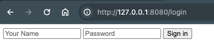

## 1. 管理静态页面模版

1. 在项目根目录中， 创建 `tmpl` 管理静态页面模版。
2. 创建 `tmpl/login.tmpl` 作为登陆页面

```html
<!DOCTYPE html>
<html lang="en">
<head>
  <meta charset="UTF-8">
  <meta name="viewport" content="width=device-width, initial-scale=1.0">
  <title>Login</title>
</head>
<body>
  <div class="main">
    <form action="/login" method="post">
      <input type="text" name="name" placeholder="Your Name">
      <input type="password" name="password" placeholder="Password">
      <button type="submit">Sign in</button>
    </form>
  </div>
</body>
</html>
```

## 2. gin 加载静态模版， 并对外提供路由

1. 使用 `r.LoadHTMLGlob("tmpl/*")` 缓存静态文件
2. 在使用时， 就直接使用相对路径了。 `c.HTML(http.StatusOK, "login.tmpl", nil)`

```go
package main

import (
	"net/http"

	"github.com/gin-gonic/gin"
)

func main() {
	// #2. 使用 LoadHTMLGlob 加载模板文件
	r.LoadHTMLGlob("tmpl/*")

	// Login GET
	r.GET("/login", getLoginHandler)

}


func getLoginHandler(c *gin.Context) {
	// #2. 使用模版文件
	// 完整页面， 没有数据传入
	c.HTML(http.StatusOK, "login.tmpl", nil)
}
```

## 3. 启动服务， 查看结果

访问登陆页面 `/login`


