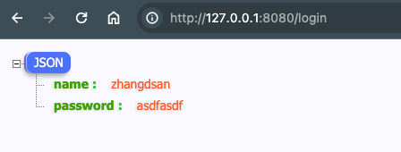

## 1. 创建 User 接受数据

1. `form` 用于绑定 post 提交的数据
2. `json` 用于返回展示。

```go
type User struct {
	Name     string `form:"name"  json:"name"`
	Password string `form:"password"  json:"password"`
}
```

## 2. 创建 postLoginHandler 实现绑定逻辑

这里看注释。

需要 **注意** 在错误处理之后， 使用 return 结束逻辑。

```go
func postLoginHandler(c *gin.Context) {
	// #5 获取表单数据
	user := &User{}

	err := c.ShouldBind(user)
	if err != nil {
		c.String(http.StatusBadRequest, "bad request")
		// 显示错误信息之后， 一定要 return 结束后序逻辑
		return
	}

	// 成功后显示用户信息
	c.JSON(http.StatusOK, user)
}
```

## 3. 绑定 Post 路由

虽然绑定的 **都是** `/login` 路径。 但是由于请求方法不同 `GET / POST`， 路由规则是合法的。

```go
	// Login GET
	r.GET("/login", getLoginHandler)
	// #5. 获取表单数据
	r.POST("/login", postLoginHandler)
```

但是， 如果 **路径** 和 **方法** 一致， 则会 **冲突** 并 panic。


## 4. 测试




