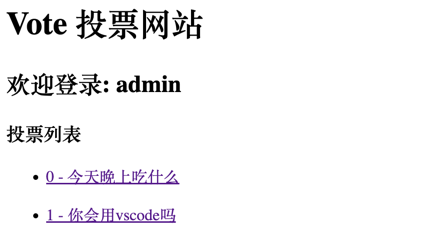

## 1. 渲染数据到登录后首页

> https://www.bilibili.com/video/BV1AZ42117JH/

1. 在 `logic/index.go` 页面中从 model.vote 中数据所有投票数据。

```go
func IndexLogin(c *gin.Context) {

	name, _ := c.Cookie("name")

	// 获取所有投票数据
	votes, err := model.GetVotes()
	if err != nil {
		c.JSON(http.StatusBadRequest, tools.Ecode{
			Code:    http.StatusBadRequest,
			Message: err.Error(),
		})
	}

	// 添加到 data 中进行渲染
	data := map[string]any{
		"Name":  name,
		"Votes": votes,
	}
	c.HTML(200, "index-login.tmpl", data)
}
```

2. 在 `view/index-login.tmpl` 中添加投票数据渲染模版

```html
<h3>投票列表</h3>
{{ range $key, $value := .Votes }}
<ul>
    <li>{{ $key}} - {{ $value.Title }}</li>
</ul>
{{ end }}
```


## 2. 根据ID获取投票信息并渲染

> https://www.bilibili.com/video/BV1at421t7e7/

1. 在 `model/vote.go` 中添加根据ID获取投票信息的方法

```go
// GetVotes 获取投票列表
func GetVotes() ([]Vote, error) {
	votes := make([]Vote, 0)
	tx := Conn.Table("vote").Find(&votes)
	if tx.Error != nil {
		return nil, tx.Error
	}

	return votes, nil
}
```

2. 在 `view/vote.html` 中创建投票详情模版

```html
<!-- vote 信息-->
<div class="vote">
    <h2>{{ .Title }}</h2>
    <span>状态: {{ .Status }}</span>
    <span>创建用户: {{ .UserId }}</span>
    <span>过期时间: {{ .ExpiredIn }}</span>
    <span>创建时间: {{ .CreatedTime }}</span>
</div>
```

3. 在 `logic/vote.go`  添加根据查询Vote数据并渲染页面

```go
func GetVoteHandler(c *gin.Context) {
	idStr := c.Query("id")
	if idStr == "" {
		c.JSON(http.StatusBadRequest, tools.EcodeBadRequest("id is required"))

		return
	}

	id, err := strconv.ParseInt(idStr, 10, 64)
	if err != nil {
		c.JSON(http.StatusBadRequest, tools.EcodeBadRequest("id is invalid"))
		return
	}

	vote, err := model.GetVote(id)
	if err != nil {
		c.JSON(http.StatusBadRequest, tools.EcodeBadRequest(err.Error()))
		return
	}

	//c.JSON(http.StatusOK, vote)
	c.HTML(http.StatusOK, "vote.html", vote)
}
```


## 3. 关联 Index 和 Vote 页面

在 `view/index-login.tmpl` 中添加跳转链接

1. 使用 a 标签跳转到 vote 页面
2. 使用 `{{ $value.Id}}` 传递参数

```html
<h3>投票列表</h3>
{{ range $key, $value := .Votes }}
<ul>
    <li>
        <!-- 使用 a 标签传递跳转页面。  -->
        <a href="/vote?id={{ $value.Id}} ">{{ $key}} - {{ $value.Title }}</a>
    </li>
</ul>
{{ end }}
```




## 4. 展示 VoteOpts 选项

1. 在 `model/vote.go` 中添加获取选项信息的方法

```go
// GetVoteOptsByVoteId 根据投票 ID 查询选项
func GetVoteOptsByVoteId(voteId int64) ([]VoteOpt, error) {
	voteOpts := make([]VoteOpt, 0)
	tx := Conn.Table("vote_opt").Where("vote_id = ?", voteId).Find(&voteOpts)
	if tx.Error != nil {
		return nil, tx.Error
	}

	return voteOpts, nil
}
```

2. 在 `logic/vote.go` 中获取选项信息并渲染到页面。

> 注意: 由于同时返回了 Vote 和 VoteOpts 信息。 因此使用 `map[string]any` 作为数据容器。 对应的模版也需要进行更改。，

```go
func GetVoteHandler(c *gin.Context) {

	vote, err := model.GetVote(id)
	opts, err := model.GetVoteOptsByVoteId(id)

	// 使用 data 组合 vote 和 vote_opt 数据
	data := map[string]any{
		"Vote": vote,
		"Opts": opts,
	}

	c.HTML(http.StatusOK, "vote.html", data)
}
```


2. 在 `view/vote.html` 中， 添加选项信息展示

```html
<!-- vote 信息-->
<!-- 修改数据结构字段， 增加 .Vote -->
<div class="vote">
    <h2>{{ .Vote.Title }}</h2>
    <span>状态: {{ .Vote.Status }}</span>
    <span>创建用户: {{ .Vote.UserId }}</span>
    <span>过期时间: {{ .Vote.ExpiredIn }}</span>
    <span>创建时间: {{ .Vote.CreatedTime }}</span>
</div>

<!-- 新增 VoteOpt 信息-->
<!-- vote_opt 信息-->
<div class="vote-opt">
    <ul>
        {{ range $key, $value := .Opts }}
        <li>{{ $value.Id}} - {{ $value.Name }} - {{ $value.Count }}</li>
        {{ end }}
    </ul>
</div>
```


